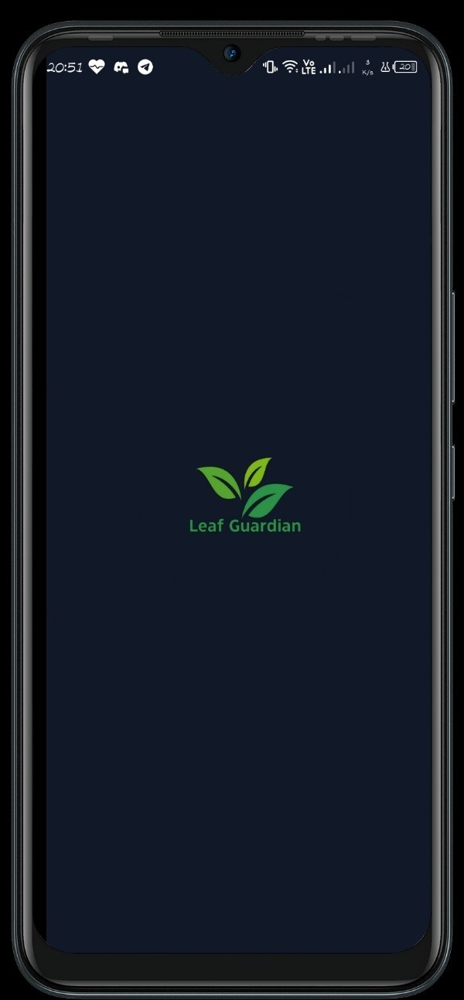
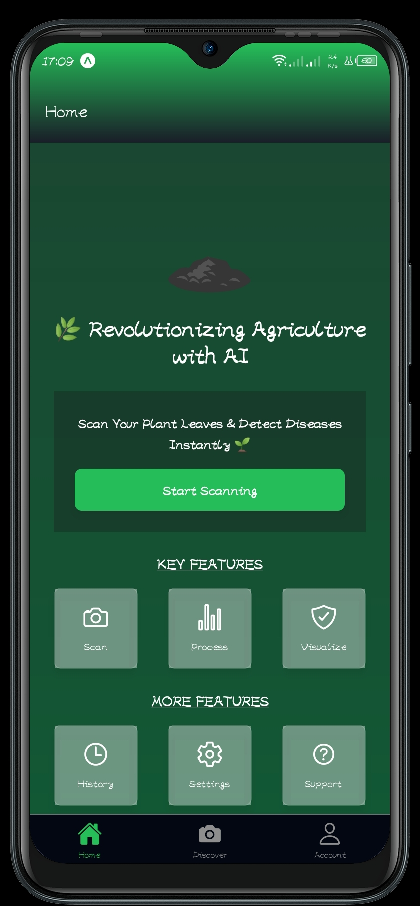
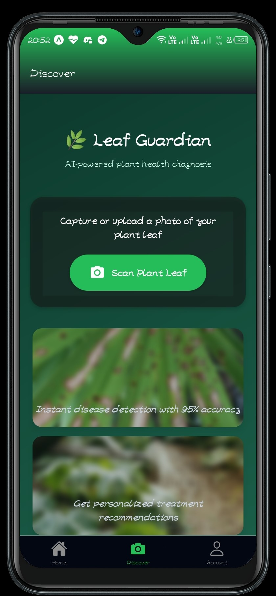
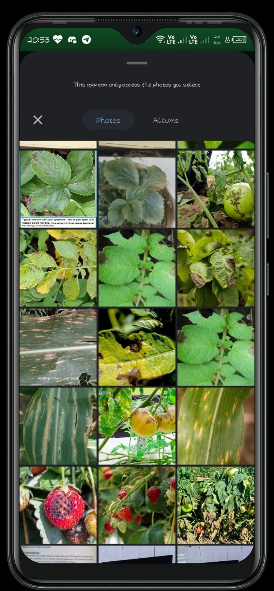
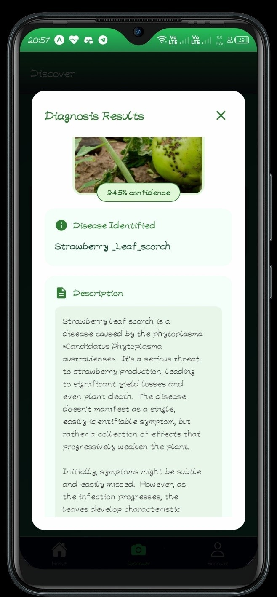

# LeafGuardian-Mobile-App

## Description

The LeafGuardian mobile application helps users diagnose plant diseases by analyzing images of leaves. Users can either capture a new image using their device's camera or upload an existing image from their gallery. The application then sends the image to a backend server for analysis, which returns a prediction of the disease, a description of the disease, and suggestions for treatment.


## Screenshots
## Screenshots

<div style="display: flex; flex-wrap: wrap; gap: 10px;">
  
  
  
    
  
</div>

## Features and Functionality

*   **Image Capture/Upload:** Allows users to take a photo of a leaf directly within the app or upload an image from their device's gallery.
*   **Disease Diagnosis:** Sends the image to a backend API for disease prediction.
*   **Prediction Results:** Displays the predicted disease name, a detailed description of the disease, and treatment suggestions.
*   **Splash Screen:** Shows a splash screen on app launch while the app loads.
*   **Tab Navigation:** Uses a tab-based navigation system with "Home" and "About" tabs.
*   **Theming:** Supports light and dark themes, adapting to the user's system preferences.
*   **Haptic Feedback:** Provides haptic feedback on tab presses (iOS only).
*   **Error Handling:** Displays alerts if permission is not granted or if the image processing fails.

## Technology Stack

*   **React Native:** A framework for building native mobile applications using JavaScript and React.
*   **Expo:** A platform for building, deploying, and quickly iterating on native iOS and Android apps using JavaScript and React Native.
*   **Expo Router:** A file-based routing library for React Native.
*   **React Native Reanimated:** A library for creating smooth and performant animations in React Native.
*   **Expo Image Picker:** Provides access to the device's camera and photo library.
*   **Expo Haptics:** Provides access to the device's haptic feedback capabilities.
*   **Expo Symbols:** Provides access to SF Symbols on iOS.
*   **Nativewind:** Uses Tailwind CSS syntax to style React Native apps.
*   **Expo Blur:** Provides a cross-platform blur view component.
*   **react-native-safe-area-context:** Provides safe area information for handling screen edges.
*   **axios:** (Not explicitly mentioned but likely used for API calls to the backend - should be verified in `package.json` and code).

## Prerequisites

Before running the application, ensure you have the following installed:

*   **Node.js:** JavaScript runtime environment.
*   **npm or Yarn:** Package manager.
*   **Expo CLI:**  `npm install -g expo-cli` or `yarn global add expo-cli`.
*   **Expo Go app:** Installed on your iOS or Android device or emulator.

## Installation Instructions

1.  Clone the repository:

    ```bash
    git clone https://github.com/Alekiie/LeafGuardian-Mobile-App.git
    cd LeafGuardian-Mobile-App
    ```

2.  Install dependencies:

    ```bash
    npm install
    # or
    yarn install
    ```

## Usage Guide

1.  Start the Expo development server:

    ```bash
    npm start
    # or
    yarn start
    ```

2.  Scan the QR code with the Expo Go app on your mobile device, or run on an emulator.

3.  **Home Screen (`app/(tabs)/index.tsx`):**
    *   Tap the "Start Scan" button to open the image selection modal.
    *   Choose to either "Capture from Camera" or "Upload from Gallery".
    *   After selecting an image, the app will send it to the backend for processing.
    *   A loading indicator will be displayed while the image is being processed.
    *   The prediction results, including disease name, description, and suggestions, will be shown in a modal.
    *   The "My Scans" card provides a link to the history screen (currently a placeholder `/history` Link).

4.  **About Screen (`app/(tabs)/explore.tsx`):**
    *   Displays information about the app and its developer.

## API Documentation

The application communicates with a backend API endpoint at `https://stable-cowbird-needed.ngrok-free.app/predict`.

**Endpoint:** `/predict`

**Method:** `POST`

**Request Body:** `multipart/form-data` with a file field containing the image of the leaf.

**Response:** `JSON` object containing the following keys:

*   `"Disease name"`: The predicted disease name.
*   `"Description"`: A detailed description of the disease.
*   `"Suggestions"`: Treatment suggestions.

**Example Response:**

```json
{
  "Disease name": "Apple Scab",
  "Description": "Apple scab is a fungal disease that affects apples and crabapples. Symptoms include olive-green to brown spots on leaves, fruit, and twigs.",
  "Suggestions": "Apply fungicides containing myclobutanil or captan."
}
```

**Important:** The backend URL (`https://stable-cowbird-needed.ngrok-free.app/predict`) uses `ngrok`. This URL will change periodically, and you may need to update it in the `app/(tabs)/index.tsx` file. This backend is likely for demonstration purposes only and may not be reliable.

## Contributing Guidelines

Contributions are welcome! To contribute to the project, follow these steps:

1.  Fork the repository.
2.  Create a new branch for your feature or bug fix.
3.  Make your changes and commit them with descriptive commit messages.
4.  Push your changes to your fork.
5.  Submit a pull request to the main repository.

## License Information

No license information is specified in the provided data. Please add a license file (e.g., `LICENSE`) to the repository and update this section accordingly. For example:

```
This project is licensed under the [MIT License](LICENSE).
```

## Contact/Support Information

For questions or support, please contact:

Alexander Maina - (No Contact Info Provided)

You can also open an issue on the GitHub repository for bug reports or feature requests.
